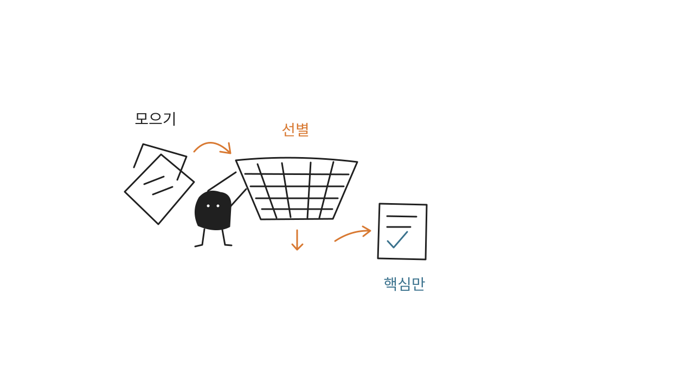
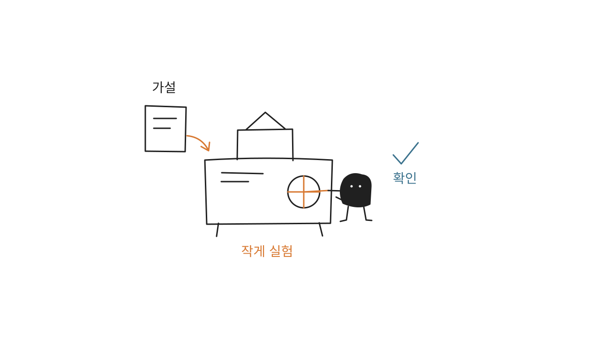
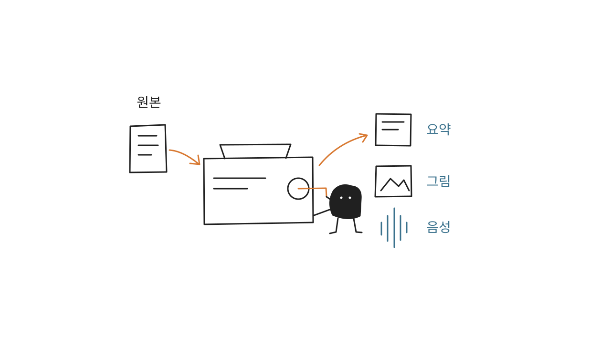
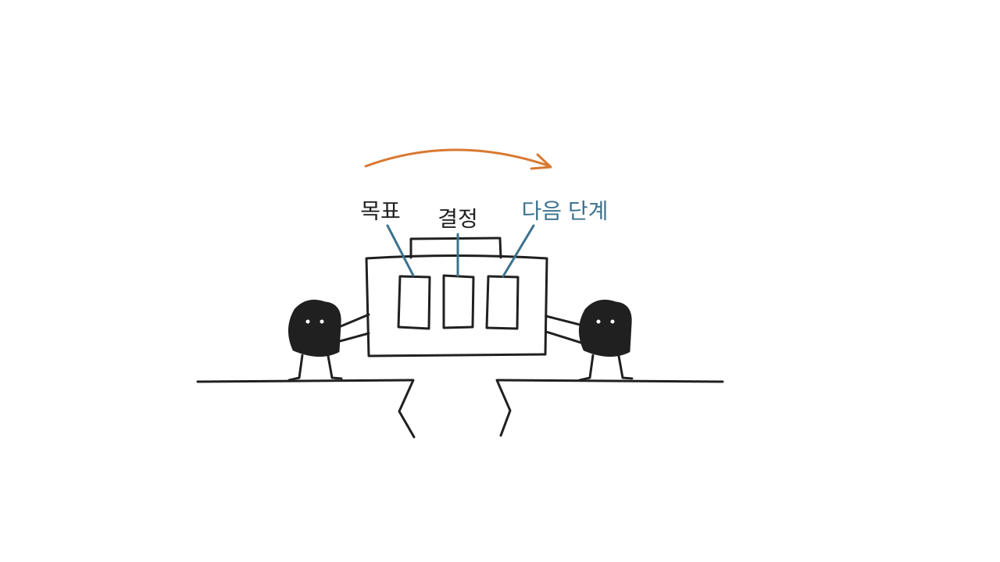

# 샤오헤이 본문 일러스트

> 한국어 글의 핵심 생각을 흰 배경의 간결하고 엉뚱한 손그림으로 표현하는 AI 에이전트 스킬입니다.
>
> 16:9 가로형 · 검은 캐릭터 · 넉넉한 여백 · 짧은 한글 주석

## 무엇을 하는 스킬인가요?

기사, 블로그, 업무 문서, 지식 콘텐츠에서 그림으로 설명할 가치가 있는 부분을 찾아 본문 삽화를 기획하고 생성합니다. 글 전체를 도표로 옮기기보다 한 장에 하나의 판단, 흐름, 상태 또는 비유를 담습니다.

샤오헤이는 검은 몸, 흰 점 눈, 가느다란 팔다리를 가진 무표정한 작은 캐릭터입니다. 장식처럼 서 있는 대신 자료를 분류하고, 틈을 메우고, 장치를 돌리는 등 그림의 핵심 행동을 직접 수행합니다.

**슬라이드나 복잡한 정보 도표가 아니라, 글의 한 가지 생각을 기억하게 만드는 설명 그림을 만듭니다.**

## 기본 결과물

- 일반적인 글은 4~8장의 장면 계획, 짧은 글은 1~3장.
- 각 장면의 삽입 위치, 전달할 생각, 구성, 캐릭터 행동, 정확한 한글 표기.
- 이미지 생성 도구로 만든 개별 PNG 파일. 기본 저장 위치는 `assets/<article-slug>-illustrations/`.

계획만 요청하면 이미지를 생성하지 않습니다. 이미지 생성 기능이 없는 환경에서는 계획과 프롬프트만 제공하며, 생성하지 않은 이미지를 완성본이라고 안내하지 않습니다. SVG, HTML, PPTX, PDF 제작은 기본 결과물이 아닙니다.

## 설치

이 저장소를 내려받고 **안쪽의 `xiaohei-illustrations` 폴더**를 스킬 디렉터리에 복사합니다. 아래는 기존 Codex 스킬 디렉터리를 사용하는 설치 예시입니다.

```bash
git clone https://github.com/rca32/xiaohei-illustrations.git
cd xiaohei-illustrations
mkdir -p "${CODEX_HOME:-$HOME/.codex}/skills"
cp -R ./xiaohei-illustrations "${CODEX_HOME:-$HOME/.codex}/skills/"
```

Windows PowerShell:

```powershell
git clone https://github.com/rca32/xiaohei-illustrations.git
Set-Location xiaohei-illustrations
$codexHome = if ($env:CODEX_HOME) { $env:CODEX_HOME } else { Join-Path $HOME '.codex' }
$skillsDir = Join-Path $codexHome 'skills'
New-Item -ItemType Directory -Force -Path $skillsDir | Out-Null
Copy-Item -Recurse -Path .\xiaohei-illustrations -Destination $skillsDir
```

사용 중인 에이전트가 별도 스킬 경로를 요구하면 같은 폴더를 해당 경로에 설치하세요. 기존 개인명 접두사 버전이 설치되어 있다면 새 버전의 인식을 확인한 뒤 이전 폴더를 제거해 중복 호출을 피하세요. 실행 이름은 `$xiaohei-illustrations`입니다.

## 바로 사용하기

### 글에 어울리는 그림부터 기획하기

```text
$xiaohei-illustrations
아래 글에 들어갈 그림을 5장 정도 기획해 줘. 아직 이미지는 만들지 마.
각 그림의 삽입 위치, 핵심 생각, 샤오헤이의 행동, 정확한 한글 표기를 써 줘.

<본문 붙여넣기>
```

### 본문 그림 생성하기

```text
$xiaohei-illustrations
아래 한국어 글에 들어갈 그림 4장을 각각 생성해 줘.
16:9 가로형, 순백색 배경, 검은 손그림 선, 짧은 한글 주석을 사용해.
샤오헤이가 핵심 행동을 직접 하게 하고, 한 장에 한 가지 생각만 담아 줘.

<본문 붙여넣기>
```

### 한 가지 생각을 그림으로 표현하기

```text
$xiaohei-illustrations
"많이 모으는 것보다 필요한 정보를 골라내는 것이 중요하다"를 한 장으로 그려 줘.
샤오헤이가 커다란 체를 움직여 종이 더미에서 필요한 쪽지만 걸러내게 해.
그림 속 문구는 "모으기", "선별", "핵심만"으로 제한해 줘.
```

전체 사용 예시와 여덟 가지 한국어 주제는 [프롬프트 예제](examples/prompts.md)를 참고하세요.

## 한국어 구성 예제

아래는 한글 표기와 장면 구성을 검토하기 위해 직접 작성한 **SVG 예시**입니다. AI 이미지 생성 결과가 아니며, 최종 손그림 질감을 보여 주는 품질 샘플도 아닙니다. 실제 그림은 이미지 생성 도구를 사용하고 [시각 스타일](xiaohei-illustrations/references/style-dna.md)을 기준으로 검수합니다.

### 정보 과부하: 모으기보다 선별하기



### 작은 검증: 크게 만들기 전에 시험하기



### 콘텐츠 재사용: 원본 하나를 여러 형식으로



### 맥락 인계: 파일보다 판단의 맥락 전달하기



나머지 네 장과 각 장면의 한글 표기는 [전체 예제 목록](xiaohei-illustrations/assets/examples/README.md)에서 확인할 수 있습니다. 예제는 설치 폴더 안에서 한 벌만 관리합니다. 새 글을 작업할 때는 예제의 물건이나 구도를 그대로 반복하지 않습니다.

## 작업 원칙

순백색 배경, 검은 손그림 선, 넓은 여백을 기본으로 합니다. 빨강은 문제와 강조, 주황은 주요 움직임, 파랑은 보조 설명에만 절제해 사용합니다. 한글 주석은 보통 3~5개, 최대 8개이며 각 주석은 짧은 단어 또는 어구로 씁니다.

그림에 요청하지 않은 제목, 개인 서명, 연락처, 홍보 문구, QR 코드를 넣지 않습니다. 한글 오탈자와 깨진 글자는 생성 후 직접 확인하고 수정합니다. 읽을 수 없는 글자를 삭제하거나 영문으로 바꾸는 것으로 한국어 검수를 대신하지 않습니다.

## 폴더 안내

```text
.
├── README.md                    # 사용자 안내
├── AGENTS.md                    # 저장소 수정 원칙
├── LICENSE                      # 원본 라이선스
├── NOTICE.md                    # 한국어판 및 예제 안내
├── examples/prompts.md          # 복사해서 쓰는 한국어 예시
├── scripts/check_repository.py  # 의존성 없는 정적 검사
└── xiaohei-illustrations/        # 설치할 스킬 폴더
    ├── SKILL.md
    ├── LICENSE
    ├── NOTICE.md
    ├── agents/openai.yaml
    ├── assets/examples/         # 한글 SVG 구성 예제 8개
    └── references/              # 스타일·캐릭터·구성·프롬프트·검수
```

## 저장소 검사

Python 3.9 이상에서 실행합니다.

```bash
python3 scripts/check_repository.py
```

설치 폴더, 스킬 이름, 문서 링크, 한글 예제, SVG 안전성, 라이선스 동봉을 검사합니다. 정적 검사는 실제 에이전트의 스킬 인식이나 이미지 생성 결과까지 보장하지 않습니다.

## 라이선스

[MIT 라이선스](LICENSE)를 따릅니다. 원본의 저작권 고지는 유지하며, 한국어판의 변경 범위와 예제 형식은 [NOTICE.md](NOTICE.md)에 안내합니다.
