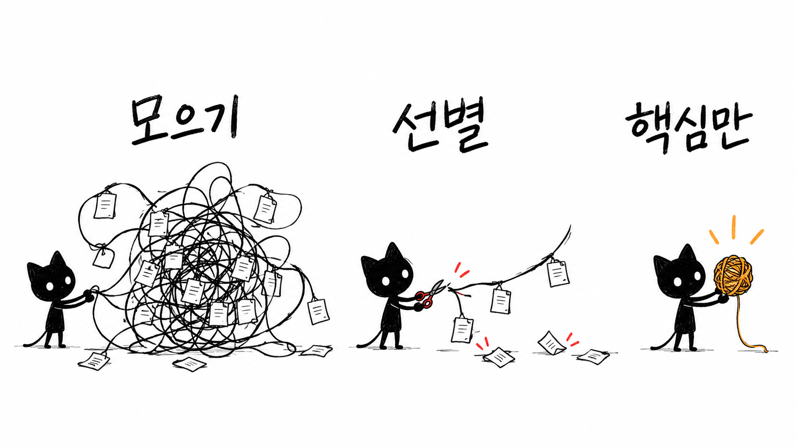
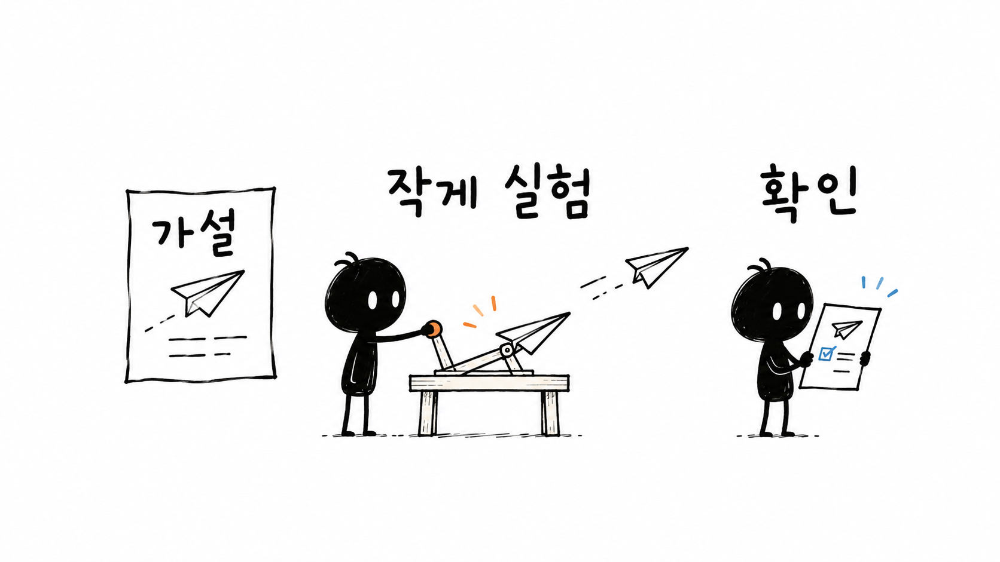
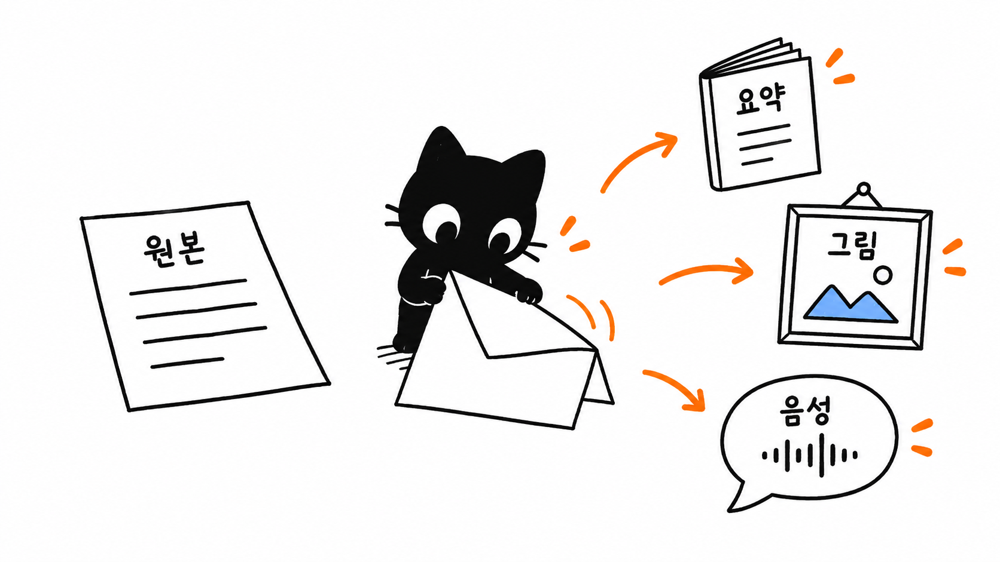
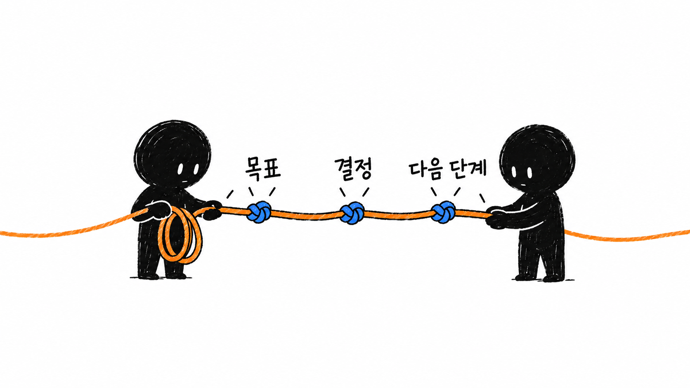
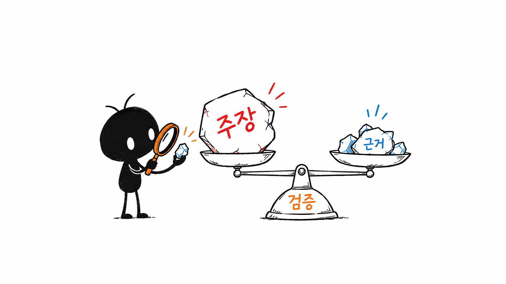
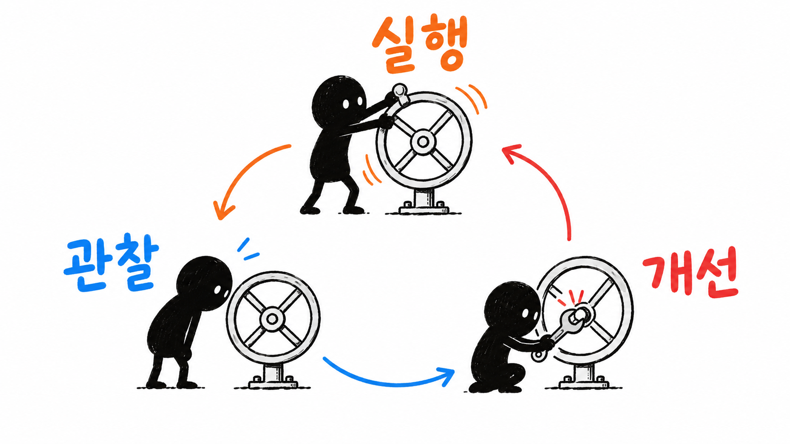
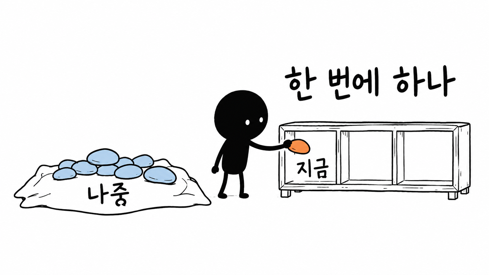
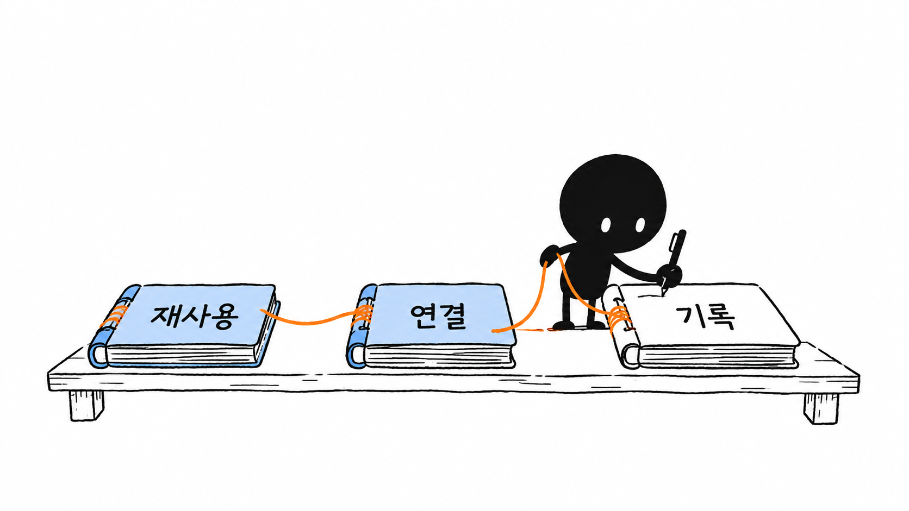

# 한국어 구성 예제

아래 여덟 장은 이미지 생성 도구로 새로 만든 한국어판 PNG 예제입니다. 장면의 의미와 한글 표기를 직접 검수했으며 최종 손그림 질감은 `../../references/style-dna.md`를 따릅니다.

새 그림을 만들 때는 [생성 프롬프트](../../references/prompt-template.md)를 사용하고, 예제는 기본 참조 이미지로 자동 주입하지 않습니다.

## 정보 과부하

한글 표기: **모으기 · 선별 · 핵심만**

## 작은 검증

한글 표기: **가설 · 작게 실험 · 확인**

## 콘텐츠 재사용

한글 표기: **원본 · 요약 · 그림 · 음성**

## 맥락 인계

한글 표기: **목표 · 결정 · 다음 단계**

## 근거로 판단하기

한글 표기: **주장 · 근거 · 검증**

## 반복 개선

한글 표기: **실행 · 관찰 · 개선**

## 우선순위

한글 표기: **나중 · 지금 · 한 번에 하나**

## 기록의 축적

한글 표기: **기록 · 연결 · 재사용**

